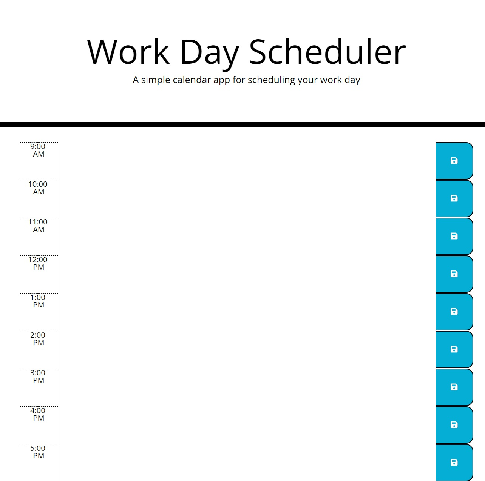

# Work Day Planner

## Description
This application serves to stand as a daily planner. Upon implementing working code, this application will be able to receive inputs into text boxes designed to be in between the hours of 9AM and 5pm, the normal business hours of a day. These inputs will be stored in local storage to be saved upon refresh.

## Installation
This application is deployed on Github pages

## Usage
This application can be used to plan the day during normal business hours, such as inputting meetings, breaks, calls and times to respond to emails. 
This can be done to increase productivity by allocating specifc time to tasks to fit all tasks into a day

## Deployment
This application is deployed on Github Pages.

URL to deployed site: 

 

## Credits
N/A

## License
MIT License